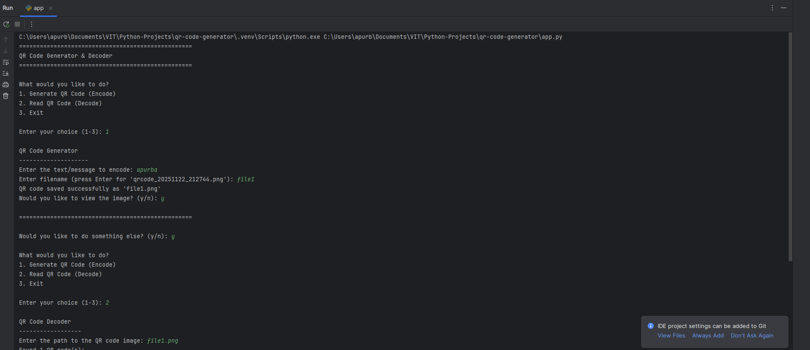

# QR Code Generator & Decoder

A user-friendly interactive Python application for creating and reading QR codes through a simple terminal interface.

## Features

- **Generate QR Codes**: Convert any text into QR code images
- **Decode QR Codes**: Extract text from existing QR code images
- **Interactive Menu**: Easy-to-use terminal interface with clear prompts
- **Auto-generated Filenames**: Timestamps prevent file conflicts
- **Image Preview**: Option to view generated/decoded QR codes
- **Multiple Format Support**: Handles various image formats for decoding


## Installation

1. Clone or download this repository
2. Set up virtual environment and install dependencies:

```powershell
python -m venv .venv
.\.venv\Scripts\Activate.ps1
pip install -r requirements.txt
```

### Main Menu Options

1. **Generate QR Code (Encode)**
   - Enter your text/message
   - Choose filename (or use auto-generated name)
   - Optionally view the created QR code

2. **Read QR Code (Decode)**  
   - Provide path to QR code image
   - View decoded text content
   - Optionally display the original image

3. **Exit**
   - Close the application

## Dependencies

- `qrcode` - QR code generation
- `Pillow` - Image processing
- `pyzbar` - QR code decoding

## Screenshots & Demo

### Application Screenshots

*QR Code application interface*


*Application in action*

### Sample QR Code

*Example QR code generated by the application*

### Demo Video
[Project Demo](recordings/project.mp4)
*Complete application walkthrough (MP4 format)*

## Notes

- Generated QR codes are saved as PNG files
- The decoder can handle multiple QR codes in a single image
- Ensure QR code images are clear and properly oriented for best results
